# Bitcoin Franzy
## _LSTM Stock Predictor with Fear and Greed_

Are you excited to forecast bitcoin prices? That is why deep learning recurrent nerual networks (RNNs) are used to predict bitcoin closing prices. Two prediction models are discussed in this assignment:

In one model, windows of bitcoin daily closing prices are used to predict the closing price of the following day through LSTM RNN. 

Daily [Crypto Fear and Greed Indice (FNGs)](https://alternative.me/crypto/fear-and-greed-index/) are used for defined time windows to predict the next day's bitcoin closing price. 

## **Prepare the data for training and testing**
To split the data, we mannually coded 70% for training and 30% for testing for each of the window sizes. Since the distribution of the bitcoin closing prices are uncertain, we use `MinMaxScaler` to scale the data into a range from 0 to 1. It follows that the training and testing data for X, the feature column, are transformed and reshaped. For `window_size=1`, the shape of X became (377, 1, 1) following the instruction `reshape((X_train.shape[0], X_train.shape[1], 1))` for X_train. 

## **Build and train custom LSTM RNNs**
Epochs of 50 and batch size of 10 are used for the evaluation models. For Layer 2 of the **LSTM sequential** model, an activation function `tanh` is added in to minimize training losses. We use 30 units and a dropout fraction of 0.2 to avoid overfitting. 

For the model, we use optimizer `adam` and `mean_squared_error` for loss to determine the fitness of our models for different time windows and evaluation metrics. Since data is in time series, we set `shuffle=False` for fitting the model and one version of the validation data. 

## **Evaluation Results**
* _**Which model has a lower loss?**_

For producing the smallest loss, namely 0.0018, the model based on previous day's closing price from `window_size=1` and valuation data defined by the following script appears to be the winner:
```python
# Creating validation data sets
from sklearn.model_selection import train_test_split
X_train, X_val, y_train, y_val = train_test_split(X_train, y_train, test_size = 0.3, random_state=2) 
```
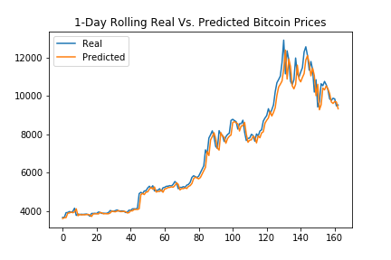
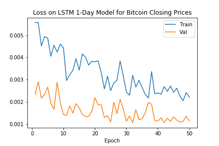

Since training loss continues to decreasing at the end, the model is underfitting and training process may be continued. Moreover, the plot for losses suggests the need to find more representative validation data as the validation losses are lower than training losses. The orange line falls below the blue line. 

Since bitcoin closing prices are time series data, the model with `window_size=1` based on bitcoin closing price and FNG prices also produces less loss compared to other models. The valiation data is generated from the following script:

```python
# Creating validation data sets
from sklearn.model_selection import train_test_split
X_train, X_val, y_train, y_val = train_test_split(X_train, y_train, test_size = 0.3, shuffle=False, random_state=2) 
```
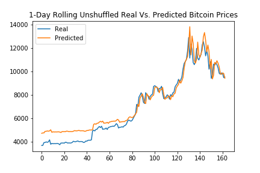
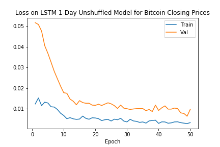

According to the loss figure, we can see that the curves are smoother. The validation data as represented by the orange line is above the blue traning loss. The losses continue to decrease while the gaps diminishes. It shows more representative validation data with potentially premature dermination of the process. 

* _**Which model tracks the actual values better over time?**_

The above model also tracts the actual values better over time as shown in the plot after comparing plots of the same type over different time windows. The orange predicted prices closely tracks the blue real price. It is not surprising as they are both bitcoin closing prices, lagged by one day. 

* _**Which window size works best for the model?**_

In comparison, based on evaluation results shown below, a window size of 1, meaning one day of lag, creates the best models. It generates the least amount of loss among models based on a range of window sizes from 1 to 10. 

A window size of 1 also produces better forecasts for its model for FNG Indicator. Figures on the model is shown below:

For FNG predictor models, its corresponding graphs for unshuffled validation data appears as follows:

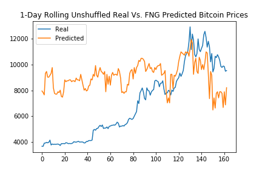
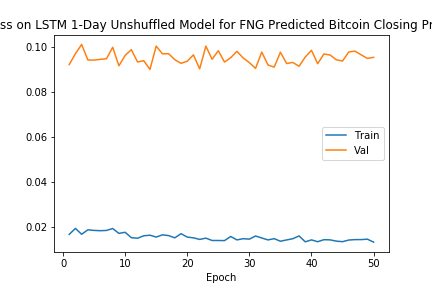


* Another model that produces relatively low losses is the model 

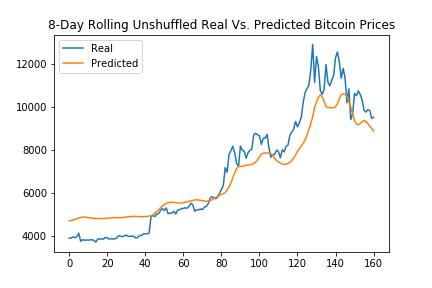
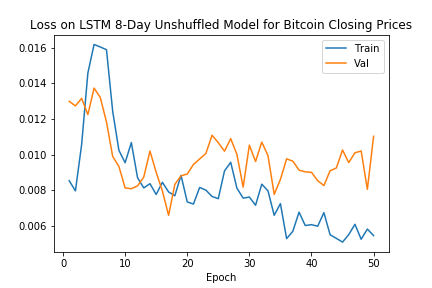

Since the gap between validation and traning losses widens, the model is overfitting. 

Its FNG predictor models are shown as follows:

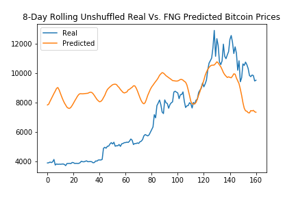
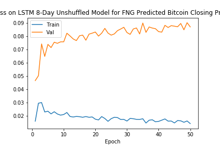


The loss plot suggests that we need more representative the validation data. 

_**Detailed results are shown in the tables below. Models that provides least losses are shown in bold:**_

### **Training Loss** 

_with **Shuffled** Validation_
| Window Size |   Closing |     FNG        |
|-------------|-----------|----------------|
|    **1**    | **0.0018**|  **0.0988**    |
|      2      |   0.0024  |    0.1017      |
|      3      |   0.0024  |    0.1040      |
|      4      |   0.0028  |    0.1182      |
|      5      |   0.0037  |    0.1073      |
|      6      |   0.0045  |    0.1012      |
|      7      |   0.0050  |    0.1086      |
|    **8**    | **0.0028**|  **0.1031**    |
|      9      |   0.0024  |    0.1111      |
|     10      |   0.0032  |    0.1153      |


_with **Unshuffled** Validation_

| Window Size |   Closing |     FNG        |
|-------------|-----------|----------------|
|  **1**      | **0.0053**| **0.0879**     |
|    **8**    | **0.0104**|  **0.1005**    |

_without Defined Validation_

| Window Size |   Closing |     FNG        |
|-------------|-----------|----------------|
|  **1**      | **0.0021**| **0.0904**     |


- - -

### **Discussion**

* A batch size of 10 is used for the models, changing it to smaller batch sizes, e.g. 5, would increase the training loss. On the other hand, decreasing batch size from 30 to 10 drops the training losses. See the following for a comparison:

_**Batch size of 10 on a window size of 9 on closing price model:**_

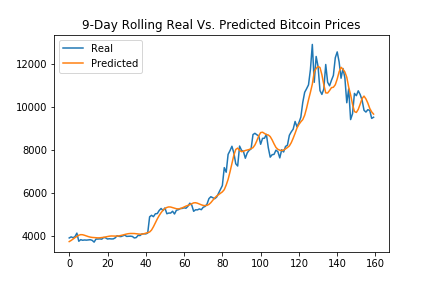
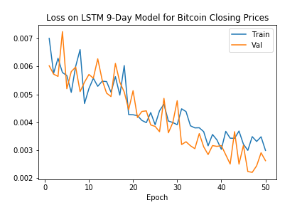

_**Batch size of 5 on a window size of 9 on closing price model:**_

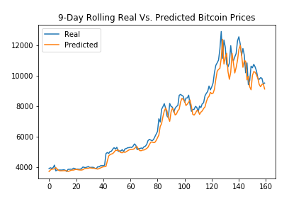
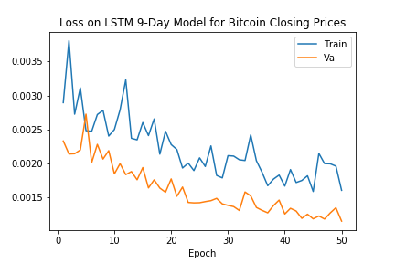


* Although LSTM has three `sigmoid` and one `tanh` built in as activation functions, one extra `tanh` was build on Layer 2. However, it was noted that `sigmoid` built onto Layer 2 would enhance the fng prediction model as the losses decreased following the change. For consistency purposes, `tanh` is used for both closing price and fng index predicting models. 

* One challenge is to find better validation data. 
    * It is possible to create a binary variable as the result following certain criteria. Additional metrics can be added in, for example, accuracy, recall, ROC and AUC, etc. 
    * A larger dataset over a longer period of time would also help. 

* In addition, LSTM models on cumulative returns may provide helpful insights on bitcoin performance. We could take natural logs, `ln`, of the bitcoin closing prices and FNG index. Similar to this assignmnet, models are evaluated to roll out the time window(s) that produce(s) least training loss. 

- - -

### Code

[Bitcoin Closing](Answers/Code/lstm_stock_predictor_closing.ipynb)

[Bitcoin FNG](Answers/Code/lstm_stock_predictor_fng.ipynb)

- - -

### Models and Plots
[Models Folder](Answers/Models)

[Plots Folder](Answers/Images)
- - - 

## References

* [Keras Sequential Model Guide](https://keras.io/getting-started/sequential-model-guide/)
* [Illustrated Guide to LSTMs](https://towardsdatascience.com/illustrated-guide-to-lstms-and-gru-s-a-step-by-step-explanation-44e9eb85bf21)
* [Stanford's RNN Cheatsheet](https://stanford.edu/~shervine/teaching/cs-230/cheatsheet-recurrent-neural-networks)
* CU Git Lab Repository
* https://machinelearningmastery.com/learning-curves-for-diagnosing-machine-learning-model-performance/
* https://www.google.com/search?q=adding+activation+function+to+lstm&rlz=1C5CHFA_enUS876US876&oq=adding+activation+function+to+lstm&aqs=chrome..69i57j33l3.6820j1j7&sourceid=chrome&ie=UTF-8
* https://www.tensorflow.org/guide/keras/train_and_evaluate
* http://docs.h5py.org/en/stable/high/file.html
* https://machinelearningmastery.com/5-step-life-cycle-long-short-term-memory-models-keras/
* https://datascience.stackexchange.com/questions/66594/activation-function-between-lstm-layers
* https://medium.com/keita-starts-data-science/time-series-split-with-scikit-learn-74f5be38489e
* https://machinelearningmastery.com/backtest-machine-learning-models-time-series-forecasting/
* https://medium.com/@julie.yin/understanding-the-data-splitting-functions-in-scikit-learn-9ae4046fbd26
* https://towardsdatascience.com/6-amateur-mistakes-ive-made-working-with-train-test-splits-916fabb421bb
* https://datascience.stackexchange.com/questions/15135/train-test-validation-set-splitting-in-sklearn
* https://towardsdatascience.com/choosing-the-right-hyperparameters-for-a-simple-lstm-using-keras-f8e9ed76f046
* https://stackoverflow.com/questions/35074549/how-to-load-a-model-from-an-hdf5-file-in-keras
* http://danielhnyk.cz/predicting-sequences-vectors-keras-using-rnn-lstm/